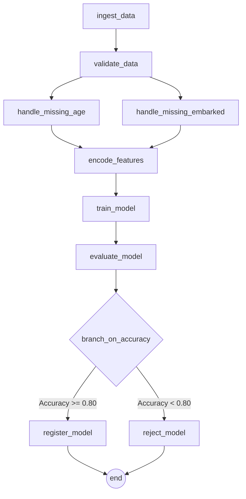

# TitanFlow: End-to-End MLOps Pipeline for Titanic Survival

TitanFlow is a complete, containerised Machine Learning Operations (MLOps) pipeline that orchestrates the training, evaluation, and logging of a Logistic Regression model on the classic Kaggle Titanic dataset. 

This project demonstrates the powerful combination of **Apache Airflow** for workflow orchestration and **MLflow** for experiment tracking and model registry, all running seamlessly locally via Docker Compose.

---

## Architecture & Technologies


- **Orchestration:** [Apache Airflow 2.8](https://airflow.apache.org/) (LocalExecutor)
- **Experiment Tracking & Model Registry:** [MLflow 2.11](https://mlflow.org/)
- **Machine Learning Layer:** `scikit-learn`, `pandas`, `numpy`
- **Infrastructure:** Docker & Docker Compose
- **Database (Metadata):** PostgreSQL 13

## Pipeline Overview (The DAG)

The Airflow Directed Acyclic Graph (DAG) `mlops_airflow_mlflow_pipeline` executes the following end-to-end steps. 


### Task Breakdown

1. **`ingest_data`**: Loads `titanic.csv` from the local `data/` directory.
2. **`validate_data`**: Verifies data quality rules (e.g., asserts that missing values in critical columns don't exceed thresholds). 
   * *Note: Configured to intentionally fail on the first attempt to demonstrate Airflow's built-in retry mechanisms.*
3. **Data Imputation (Parallel Branching)**:
   * **`handle_missing_age`**: Imputes missing ages with the median and engineers new features (`FamilySize`, `IsAlone`).
   * **`handle_missing_embarked`**: Imputes missing embarkation ports with the mode.
4. **`encode_features`**: Merges the parallel imputed branches, applies Label Encoding to categorical variables (`Sex`, `Embarked`), and drops high-cardinality/irrelevant columns.
5. **`train_model`**: Splits the dataset, trains a Logistic Regression model, and logs everything to MLflow.
6. **`evaluate_model`**: Generates metrics (`Accuracy`, `Precision`, `Recall`, `F1-Score`) against the test set and logs them to the MLflow run.
7. **`branch_on_accuracy`**: A conditional routing step evaluating the model's accuracy against a predefined threshold (80%).
8. **Conditional Outcomes (Branching)**:
   * **`register_model`**: If accuracy $\ge$ threshold, the model is formally registered in the MLflow Model Registry.
   * **`reject_model`**: If accuracy $<$ threshold, the model is rejected and tagged appropriately with the failure reason in MLflow.

---

## DAG Pipeline Diagram



##  Setup & Execution

### 1. Clone the Repository
```bash
git clone <your-repo-url>
cd TitanFlow-DAG
```

### 2. Prepare the Environment
Ensure the dataset (`titanic.csv`) is placed inside the `data/` directory.

### 3. Spin up the Infrastructure
This command builds the custom Airflow image (baking in MLflow & scikit-learn) and starts all services (PostgreSQL, Airflow Webserver/Scheduler, MLflow Tracking Server).
```bash
docker compose up --build -d
```
*Wait 1-2 minutes for the `airflow-init` container to complete database migrations.*

### 4. Access the UIs
- **Apache Airflow UI:** [http://localhost:8080](http://localhost:8080)  
  *(Login: `airflow` / `airflow`)*
- **MLflow Tracking Server UI:** [http://localhost:5000](http://localhost:5000)

### 5. Trigger the Pipeline
1. Open the Airflow UI.
2. Locate the `mlops_airflow_mlflow_pipeline` DAG.
3. Turn the toggle switch to **Unpaused**.
4. Click the **Play** button (▶️) under Actions to trigger the DAG manually.
5. Watch the Graph View as tasks execute, and open the MLflow UI to see live experiment tracking!

---

## Teardown

To shut down the cluster and clean up the containers:
```bash
docker compose down
```
*(To also wipe the database volume and start entirely fresh next time, run `docker compose down -v`)*

---

### Hyperparameter Tuning Results

| Run Name | C | Max Iter | Solver | Accuracy | F1-Score | Precision | Recall | Outcome |
| :--- | :--- | :--- | :--- | :--- | :--- | :--- | :--- | :--- |
| Run 1 | 0.01 | 100 | lbfgs | 0.65 | 0.31 | 0.67 | 0.20 | Rejected |
| Run 2 | 1.0 | 200 | lbfgs | 0.80 | 0.73 | 0.78 | 0.68 | **Registered** |
| Run 3 | 10.0 | 300 | saga | 0.73 | 0.51 | 0.83 | 0.36 | Rejected |

---

## 🛠️ Tech Stack

| Component | Technology | Version |
| :--- | :--- | :--- |
| **Orchestration** | Apache Airflow | 2.8.1 |
| **Experiment Tracking** | MLflow | 2.11.1 |
| **Machine Learning** | Scikit-Learn | 1.4.1.post1 |
| **Data Processing** | Pandas | 2.2.1 |
| **Data Processing** | Numpy | 1.26.4 |
| **Database Connector** | Psycopg2-binary | 2.9.9 |

