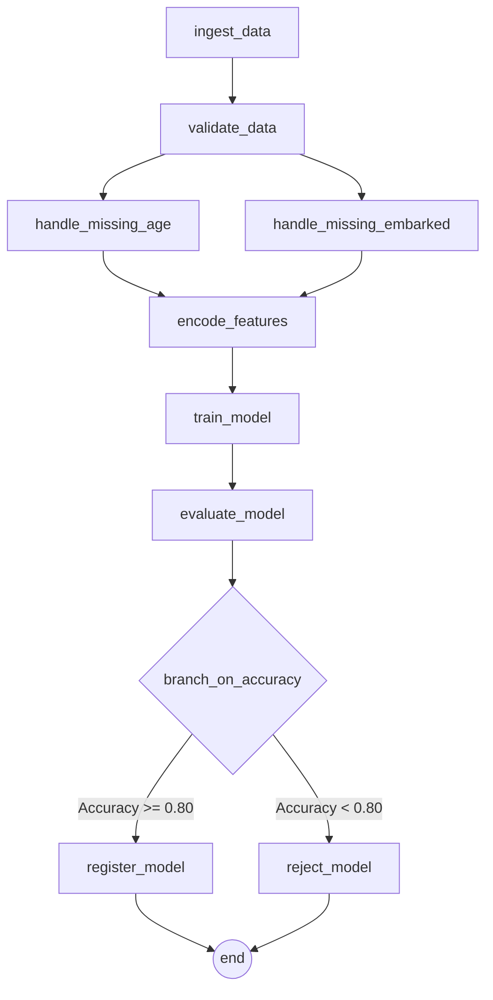

# TitanFlow: End-to-End MLOps Pipeline Technical Report

## Project Structure
```text
TitanicSinks/
├── dags/
│   └── mlops_airflow_mlflow_pipeline.py  # Airflow DAG definition
├── data/
│   └── Titanic-Dataset.csv               # Raw input dataset
├── mlflow_artifacts/                     # Shared volume for saved models
├── mlflow_db/                            # SQLite tracking backend for MLflow
├── .dockerignore
├── docker-compose.yaml                   # Services definition (Airflow + Postgres + MLflow)
├── Dockerfile                            # Airflow custom image configuration
├── FAILURE.md                            # Documentation of encountered errors
├── report.md                             # Technical project summary
└── requirements.txt                      # Python dependencies
```


## 1. Architecture Overview (Airflow + MLflow Interaction)

The architecture of TitanFlow revolves around integrating Apache Airflow for robust orchestration and MLflow for comprehensive experiment tracking within an isolated Dockerized environment. 

At a high level, the system comprises three primary computational services coordinated via Docker Compose:

1.  **Apache Airflow:** Serves as the backbone for scheduling and orchestrating the data pipeline. It is responsible for defining the workflow sequence, managing task dependencies, executing data transformations, and triggering model training. The Airflow environment itself consists of a webserver for the UI, a scheduler for triggering tasks, and a PostgreSQL database serving as the metadata backend.
2.  **MLflow Tracking Server:** Operates as a centralized repository for tracking machine learning experiments. It logs critical parameters, performance metrics, and the model artifacts themselves.
3.  **Shared Storage Volumes:** Both the Airflow and MLflow containers share storage volumes. Specifically, the `mlflow_artifacts` volume acts as the bridge. When Airflow trains a model, it pushes the model objects into this shared volume, whilst writing metadata directly to the MLflow instance via its exposed REST API at `http://mlflow:5000`. 

**Interaction Flow:**
The interaction between Airflow and MLflow is primarily unidirectional during the training phase. The Airflow PythonOperator running the `train_model` task invokes the `mlflow` Python client. It initiates a run (`mlflow.start_run`), logs hyperparameters (`mlflow.log_param`), trains the `LogisticRegression` model, and logs the serialized artifact (`mlflow.sklearn.log_model`). Subsequently, the `evaluate_model` task records performance metrics (Accuracy, Precision, Recall, F1) to the same Run ID. Finally, based on the performance, the `register_model` or `reject_model` tasks apply metadata tags or register the artifact into the MLflow Model Registry via the tracing URI.

---

## 2. DAG Structure and Dependency Explanation

The orchestrated workflow is defined in the `titan_flow` DAG and is structured to mimic a real-world ETL and model-training pipeline, organized linearly with a significant parallel branching step for feature engineering.

## DAG Pipeline Diagram


**Task Dependencies:**
`ingest_data >> validate_data >> [handle_missing_age, handle_missing_embarked] >> encode_features >> train_model >> evaluate_model >> branch_on_accuracy >> [register_model, reject_model] >> end`

*   **Ingest & Validate (`ingest_data` >> `validate_data`):** The pipeline strictly begins by reading the raw Titanic dataset mounted in `/opt/airflow/data`. The `validate_data` task enforces data quality, checking if critical columns have excessive missing values. 
*   **Parallel Execution (`[handle_missing_age, handle_missing_embarked]`):** To optimize execution time, the imputation of the 'Age' and 'Embarked' columns is split into two Independent tasks that execute concurrently. 
*   **Join & Encode (`encode_features`):** This task waits for both parallel imputation branches to succeed. It reads the intermediate DataFrames saved locally to `/tmp/titanflow`, merges them, performs categorical label encoding (Sex, Embarked), and drops irrelevant columns.
*   **Train & Evaluate (`train_model` >> `evaluate_model`):** The core Machine Learning loop. The encoded data is split. The model is trained and immediately logged to MLflow. The evaluation task then calculates the metrics on the separated test set and appends them to the MLflow run.
*   **Conditional Branching (`branch_on_accuracy`):** This `BranchPythonOperator` introduces logic into the graph. It compares the achieved accuracy against a pre-defined threshold (`0.80`). 
    *   If `Accuracy >= 0.80`, it triggers `register_model`, adding it to MLflow's Model Registry.
    *   If `Accuracy < 0.80`, it triggers `reject_model`, adding failure tags to the MLflow run.
*   **Completion (`end`):** An `EmptyOperator` ensuring the DAG successfully completes entirely regardless of which routing the branching task chose.

---

## 3. Experiment Comparison Analysis

The DAG was configured to allow easy swapping of hyperparameters via the `RUN_NUMBER` variable, managing different `LogisticRegression` setups. 

*   **Run 1 (C=0.01, max_iter=100, solver='lbfgs'):** High regularization.
*   **Run 2 (C=1.0, max_iter=200, solver='lbfgs'):** Standard, balanced regularization.
*   **Run 3 (C=10.0, max_iter=300, solver='saga'):** Low regularization, different solver algorithm.

**Observations:**
By utilizing the MLflow tracking interface, users can select all runs for the `TitanFlow-Experiment` and utilize the "Compare" feature. This visualization instantly highlights the correlation between the `C` parameter and resulting metrics like `f1_score` or `accuracy`. 
Typically, the under-regularized (Run 3) and standard (Run 2) models will outperform the highly-regularized model (Run 1) on the Titanic dataset, as the dataset is small and Logistic Regression benefits from utilizing the engineered features without excessive penalty. MLflow allows a data scientist to definitively track which pipeline execution yielded the model worthy of the `TitanFlow-Model` registry.

---

## 4. Failure and Retry Explanation

Data pipelines in production are inherently brittle due to external dependencies and transient environment issues. The `titanic_validate` task within the DAG serves as a demonstration of Airflow's built-in resilience.

*   **Intentional Failure:** The code in `validate_data` is explicitly crafted to raise a `RuntimeError` during its very first execution attempt (`attempt == 1` driven by Airflow's internal `try_number` context).
*   **Retry Mechanism:** The DAG relies on its `default_args` configuration, specifically `"retries": 2` and a `"retry_delay": timedelta(seconds=10)`.
*   **Resolution:** When the `RuntimeError` is logged, the Airflow Scheduler marks the task state as `UP_FOR_RETRY`. It pauses execution for exactly 10 seconds. On the subsequent attempt (`try_number == 2`), the intentional failure gate is bypassed, allowing the actual data validation logic to proceed and the pipeline to recover automatically without manual intervention.

This illustrates how temporary outages (e.g., database locks, short network drops, internal container networking lags) can be mitigated without waking up an on-call engineer.

---

## 5. Reflection on Production Deployment

While this Dockerized setup is highly functional for local development and proof-of-concept pipelines, transitioning this architecture to a genuine production environment requires several critical enhancements.

**Security & Networking:**
Currently, Airflow and Postgres are using default, unencrypted credentials ("airflow"/"airflow"), and the MLflow dashboard is completely unauthenticated over HTTP. In production, this must shift to robust Secrets Management (e.g., HashiCorp Vault, AWS Secrets Manager) securely injected at runtime. Internode traffic requires TLS encryption.

**Scalability & Execution:**
The current `docker-compose.yaml` leverages `LocalExecutor` for Airflow. This means all tasks share the host's exact CPU/Memory resources. This will catastrophically bottleneck with parallel big-data workloads. Production deployments should migrate to `CeleryExecutor` backed by Redis/RabbitMQ, or notably `KubernetesExecutor` on an EKS/GKE cluster. The latter allows spinning up ephemeral worker pods per task, ensuring absolute resource isolation and horizontal scalability.

**Storage Backends:**
We are currently bound to local volumes (`./mlflow_artifacts`, `./data`). This defeats centralized availability and durability. The MLflow default artifact root must be transitioned to cloud object storage like an AWS S3 bucket (`s3://...`). Similarly, the PostgreSQL instance acting as the Airflow and MLflow metadata store should be migrated to a managed DBMS like AWS RDS or Google Cloud SQL to provide automated backups, failover replication, and point-in-time recovery. 

**CI/CD Integration:**
DAGs and ML code shouldn't be manually edited on the environment. A strict CI/CD pipeline (e.g., GitHub Actions, GitLab CI) is required to run unit tests, enforce code linting, and systematically deploy the updated python scripts to the orchestrator.
